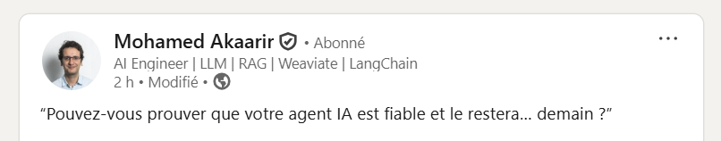

“Pouvez-vous prouver que votre agent IA est fiable et le restera… demain ?”

C’est LA question qui revient à chaque comité projet – et soudain, le silence. Tout le monde réalise que sans indicateurs solides, impossible de passer du POC brillant au produit auditable.

Autrement dit : comment garantir, chiffres à l’appui, qu’un LLM gardera son cap ?

Bienvenue dans l’Evaluation Engineering!

Pourquoi ce n’est plus optionnel ?

- Les contextes explosent (multimodal, temps réel, fonctions externes).
- Les modèles évoluent chaque trimestre.
- Les régulateurs (et vos clients) demandent des garanties mesurables.

Trois briques concrètes pour passer de “ça marche !” à “c’est robuste” :

-- Synthetic Bench : générer automatiquement des jeux de tests variés (langues, edge-cases, biais). On valide la logique avant le premier utilisateur.

-- Continuous Eval Loop : brancher la prod sur un pipeline d’échantillonnage + scoring (RAGAS, Promptfoo, OpenAI Evals…). Les métriques vivent dans Grafana, pas dans un Google Doc.

-- Guardrail Contracts : déclarer un contrat d’output (schema JSON, ton, policy RLHF) et laisser un “rail” bloquer ou corriger avant livraison.
↳ Format émergent : Model Guard Protocol – un manifest lisible par humain et machine.

Résultat :

- Drift détecté en < 30 min au lieu de 3 semaines.
- Hallucinations divisées par 4.
- Chiffres RPS/latence + budget tokens sous contrôle, même quand on swap de modèle.
- Et surtout : l’équipe produit ose shipper plus vite (A/B sûrs, rollback simple).

Le prompt, le contexte, l’orchestration ? Toujours clés.
Mais sans une boucle d’évaluation continue, c’est comme coder sans tests unitaires : on avance… les yeux fermés.

En bref : La prochaine frontière se joue dans les métriques, pas dans la magie.
“Ce qu’on ne mesure pas, on ne l’améliore pas.”
